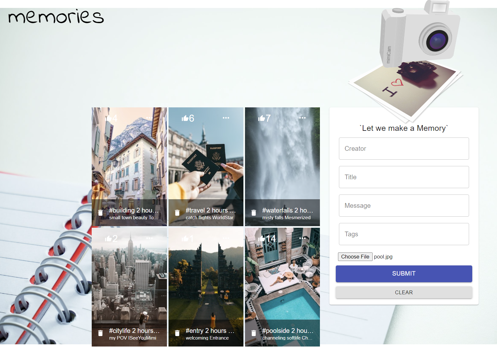
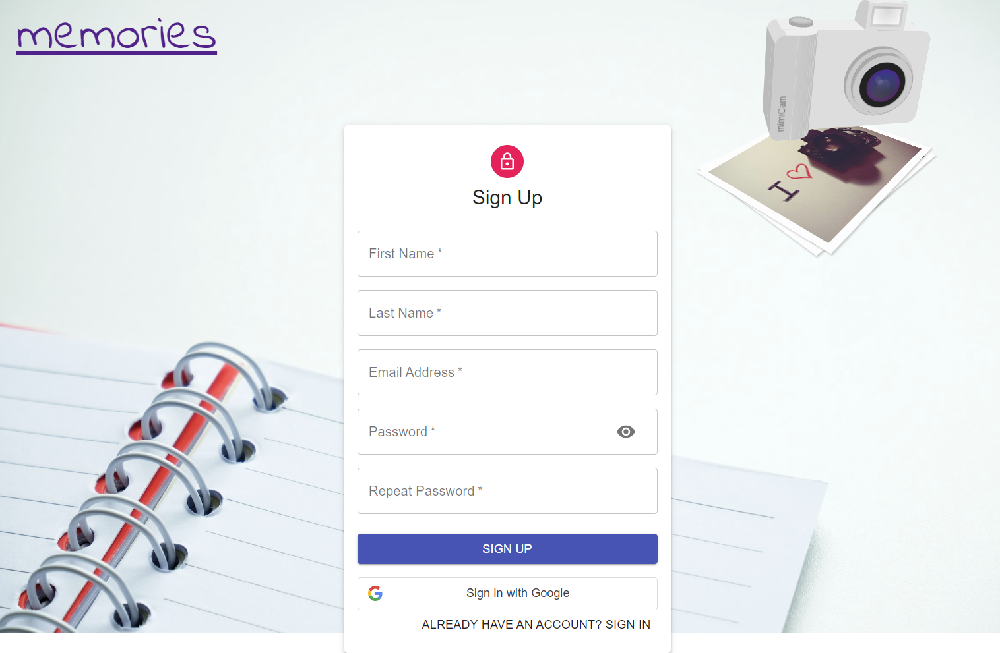

# memories-app

## Description 
MERN Full-stack responsive social media application with email and Google Identity Services, pagination, search and filtering capabilities, comments. 

## Features
By leveraging RESTFUL APIs, we fetch, create, update, like and delete posts. 

## Tech Stack
- Express
- Cors
- Bodyparser
- process.env
- Redux
- React 18.2
- Material UI
- [MongoDB](https://www.mongodb.com/atlas/database)

## Tutorial 
[MERN Stack- JSMastery](https://www.youtube.com/watch?v=VsUzmlZfYNg)
[Mern-Stack - JSMastery](https://www.youtube.com/watch?v=CcBHZ0t2Qwc)

## Project Setup

Run `npm i` && `npm start` for both client and server side to launch app